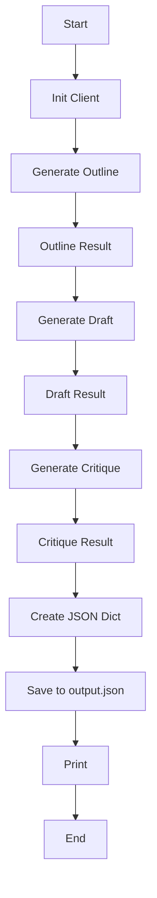

# Draft Critique Generation with Gemini API and saving it in a JSON file.

This project is about generating a draft from a topic and critiquing it through **Google GenAI** and saving the output in a **JSON File**

## Workflow

## Steps to Run the Code

1. Cloning the repository:

git clone https://github.com/blackstag2k/JSON-Draft-Generation.git

2. Installing the Dependencies for the project:

* dependencies listed in the requirements.txt

pip install -r requirements.txt 

* If you want to execute the installed pip module instead of a script file, then use the command below in Command Window

pip -m install -r requirements.txt

### Example:

- python -m pip install google-generativeai

3. Add your API Key 

* Google AI API, Open AI API, etc. generated from any platform. Google Genai key is used here.

export GOOGLE_API_KEY="YOUR_KEY"

4. Run

python main.py

**Output**

Output JSON:
| Topic | Outline | Draft | Critique |
|-------|--------|--------|--------|
| 5 Ways to Master Influencer Marketing | Detailed outline generated for the draft | A Draft of about 500 words generated from the outline | A critique analysing the draft on all the important factors and criteria for content generation |

## Tools Used

- Google AI API (Gemini)
- Python 3.14

## Lessons to be Learned

- Using the JSON file *output.json* as a worksheet to save the generated output.
- Executing the code through a virtual environment (.venv) like VS Code.
- Prompt chaining to execute multiple prompts and get the best results.

Documented during the Prompt Engineering Course for Prompt Chaining and Content Generation

